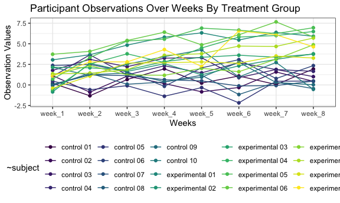
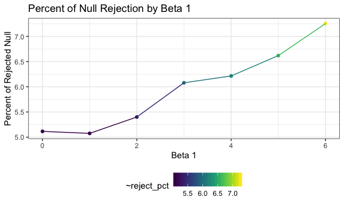
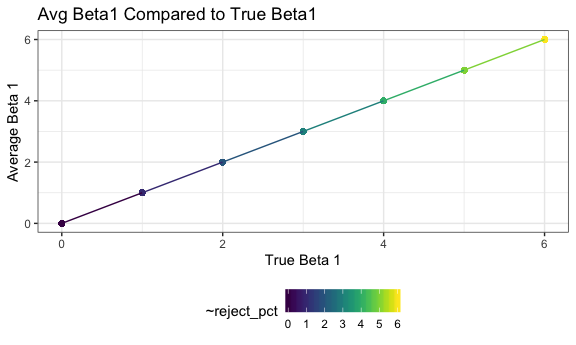
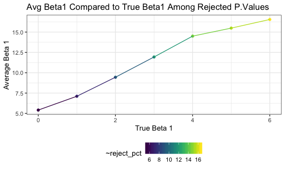

hw5
================

# Problem 1

``` r
# Code Jeff gave us
set.seed(10)

iris_with_missing = iris %>% 
  map_df(~replace(.x, sample(1:150, 20), NA)) %>%
  mutate(Species = as.character(Species))

is.list(iris_with_missing)
```

    ## [1] TRUE

``` r
missing_value = function(x) {
  if (is.numeric(x)) {                    # if the value is numeric 
    y = mean(x, na.rm = TRUE)             # take the mean of the column x and save it as a value y
    x = replace(x, is.na(x), y)           # then replace any missing values in column x with the value y
  } else if (is.character(x)) {           # if the value is character variable
    x = replace(x, is.na(x), "virginica") # replace missing values in column x with virginica
  }
}

# create an output where i map my function onto each variable in my dataframe
output = map_df(iris_with_missing, missing_value)   

# checking to see if my output really works
output 
```

    ## # A tibble: 150 x 5
    ##    Sepal.Length Sepal.Width Petal.Length Petal.Width Species
    ##           <dbl>       <dbl>        <dbl>       <dbl> <chr>  
    ##  1         5.1          3.5         1.4         0.2  setosa 
    ##  2         4.9          3           1.4         0.2  setosa 
    ##  3         4.7          3.2         1.3         0.2  setosa 
    ##  4         4.6          3.1         1.5         1.19 setosa 
    ##  5         5            3.6         1.4         0.2  setosa 
    ##  6         5.4          3.9         1.7         0.4  setosa 
    ##  7         5.82         3.4         1.4         0.3  setosa 
    ##  8         5            3.4         1.5         0.2  setosa 
    ##  9         4.4          2.9         1.4         0.2  setosa 
    ## 10         4.9          3.1         3.77        0.1  setosa 
    ## # … with 140 more rows

# Problem 2: data

``` r
# Creating a tibble of data with file names and data

prob_data = tibble(
  subject = list.files(path = "./hw5_data",      # creating a variable "files" for filenames
                     pattern = ".csv$", 
                     full.names = TRUE)) %>%
  mutate(data =  map(subject, read_csv)) %>%    # creating a variable "data" where i read the csv files
  unnest()                                    # unnesting the variable "data"
```

    ## Parsed with column specification:
    ## cols(
    ##   week_1 = col_double(),
    ##   week_2 = col_double(),
    ##   week_3 = col_double(),
    ##   week_4 = col_double(),
    ##   week_5 = col_double(),
    ##   week_6 = col_double(),
    ##   week_7 = col_double(),
    ##   week_8 = col_double()
    ## )
    ## Parsed with column specification:
    ## cols(
    ##   week_1 = col_double(),
    ##   week_2 = col_double(),
    ##   week_3 = col_double(),
    ##   week_4 = col_double(),
    ##   week_5 = col_double(),
    ##   week_6 = col_double(),
    ##   week_7 = col_double(),
    ##   week_8 = col_double()
    ## )
    ## Parsed with column specification:
    ## cols(
    ##   week_1 = col_double(),
    ##   week_2 = col_double(),
    ##   week_3 = col_double(),
    ##   week_4 = col_double(),
    ##   week_5 = col_double(),
    ##   week_6 = col_double(),
    ##   week_7 = col_double(),
    ##   week_8 = col_double()
    ## )
    ## Parsed with column specification:
    ## cols(
    ##   week_1 = col_double(),
    ##   week_2 = col_double(),
    ##   week_3 = col_double(),
    ##   week_4 = col_double(),
    ##   week_5 = col_double(),
    ##   week_6 = col_double(),
    ##   week_7 = col_double(),
    ##   week_8 = col_double()
    ## )
    ## Parsed with column specification:
    ## cols(
    ##   week_1 = col_double(),
    ##   week_2 = col_double(),
    ##   week_3 = col_double(),
    ##   week_4 = col_double(),
    ##   week_5 = col_double(),
    ##   week_6 = col_double(),
    ##   week_7 = col_double(),
    ##   week_8 = col_double()
    ## )
    ## Parsed with column specification:
    ## cols(
    ##   week_1 = col_double(),
    ##   week_2 = col_double(),
    ##   week_3 = col_double(),
    ##   week_4 = col_double(),
    ##   week_5 = col_double(),
    ##   week_6 = col_double(),
    ##   week_7 = col_double(),
    ##   week_8 = col_double()
    ## )
    ## Parsed with column specification:
    ## cols(
    ##   week_1 = col_double(),
    ##   week_2 = col_double(),
    ##   week_3 = col_double(),
    ##   week_4 = col_double(),
    ##   week_5 = col_double(),
    ##   week_6 = col_double(),
    ##   week_7 = col_double(),
    ##   week_8 = col_double()
    ## )
    ## Parsed with column specification:
    ## cols(
    ##   week_1 = col_double(),
    ##   week_2 = col_double(),
    ##   week_3 = col_double(),
    ##   week_4 = col_double(),
    ##   week_5 = col_double(),
    ##   week_6 = col_double(),
    ##   week_7 = col_double(),
    ##   week_8 = col_double()
    ## )
    ## Parsed with column specification:
    ## cols(
    ##   week_1 = col_double(),
    ##   week_2 = col_double(),
    ##   week_3 = col_double(),
    ##   week_4 = col_double(),
    ##   week_5 = col_double(),
    ##   week_6 = col_double(),
    ##   week_7 = col_double(),
    ##   week_8 = col_double()
    ## )
    ## Parsed with column specification:
    ## cols(
    ##   week_1 = col_double(),
    ##   week_2 = col_double(),
    ##   week_3 = col_double(),
    ##   week_4 = col_double(),
    ##   week_5 = col_double(),
    ##   week_6 = col_double(),
    ##   week_7 = col_double(),
    ##   week_8 = col_double()
    ## )
    ## Parsed with column specification:
    ## cols(
    ##   week_1 = col_double(),
    ##   week_2 = col_double(),
    ##   week_3 = col_double(),
    ##   week_4 = col_double(),
    ##   week_5 = col_double(),
    ##   week_6 = col_double(),
    ##   week_7 = col_double(),
    ##   week_8 = col_double()
    ## )
    ## Parsed with column specification:
    ## cols(
    ##   week_1 = col_double(),
    ##   week_2 = col_double(),
    ##   week_3 = col_double(),
    ##   week_4 = col_double(),
    ##   week_5 = col_double(),
    ##   week_6 = col_double(),
    ##   week_7 = col_double(),
    ##   week_8 = col_double()
    ## )
    ## Parsed with column specification:
    ## cols(
    ##   week_1 = col_double(),
    ##   week_2 = col_double(),
    ##   week_3 = col_double(),
    ##   week_4 = col_double(),
    ##   week_5 = col_double(),
    ##   week_6 = col_double(),
    ##   week_7 = col_double(),
    ##   week_8 = col_double()
    ## )
    ## Parsed with column specification:
    ## cols(
    ##   week_1 = col_double(),
    ##   week_2 = col_double(),
    ##   week_3 = col_double(),
    ##   week_4 = col_double(),
    ##   week_5 = col_double(),
    ##   week_6 = col_double(),
    ##   week_7 = col_double(),
    ##   week_8 = col_double()
    ## )
    ## Parsed with column specification:
    ## cols(
    ##   week_1 = col_double(),
    ##   week_2 = col_double(),
    ##   week_3 = col_double(),
    ##   week_4 = col_double(),
    ##   week_5 = col_double(),
    ##   week_6 = col_double(),
    ##   week_7 = col_double(),
    ##   week_8 = col_double()
    ## )
    ## Parsed with column specification:
    ## cols(
    ##   week_1 = col_double(),
    ##   week_2 = col_double(),
    ##   week_3 = col_double(),
    ##   week_4 = col_double(),
    ##   week_5 = col_double(),
    ##   week_6 = col_double(),
    ##   week_7 = col_double(),
    ##   week_8 = col_double()
    ## )
    ## Parsed with column specification:
    ## cols(
    ##   week_1 = col_double(),
    ##   week_2 = col_double(),
    ##   week_3 = col_double(),
    ##   week_4 = col_double(),
    ##   week_5 = col_double(),
    ##   week_6 = col_double(),
    ##   week_7 = col_double(),
    ##   week_8 = col_double()
    ## )
    ## Parsed with column specification:
    ## cols(
    ##   week_1 = col_double(),
    ##   week_2 = col_double(),
    ##   week_3 = col_double(),
    ##   week_4 = col_double(),
    ##   week_5 = col_double(),
    ##   week_6 = col_double(),
    ##   week_7 = col_double(),
    ##   week_8 = col_double()
    ## )
    ## Parsed with column specification:
    ## cols(
    ##   week_1 = col_double(),
    ##   week_2 = col_double(),
    ##   week_3 = col_double(),
    ##   week_4 = col_double(),
    ##   week_5 = col_double(),
    ##   week_6 = col_double(),
    ##   week_7 = col_double(),
    ##   week_8 = col_double()
    ## )
    ## Parsed with column specification:
    ## cols(
    ##   week_1 = col_double(),
    ##   week_2 = col_double(),
    ##   week_3 = col_double(),
    ##   week_4 = col_double(),
    ##   week_5 = col_double(),
    ##   week_6 = col_double(),
    ##   week_7 = col_double(),
    ##   week_8 = col_double()
    ## )

    ## Warning: `cols` is now required.
    ## Please use `cols = c(data)`

``` r
#tidy the resulting dataset: pivoting longer to make each column a variable, extracting out group, recoding group variable, and selecting in the order I want 

prob_data =
pivot_longer(prob_data, 
             week_1:week_8,         
             names_to = "week",
             values_to = "observations") %>%
  mutate(subject = str_extract(subject, "(con|exp)_\\d{2}"), 
         group = str_extract(subject, "con|exp"),
         group = fct_recode(group, "control" = "con",    
                            "experiment" = "exp")) %>%
  select(subject, group, week, observations)       

# making a nice table

knitr::kable(prob_data)  
```

| subject | group      | week    | observations |
| :------ | :--------- | :------ | -----------: |
| con\_01 | control    | week\_1 |         0.20 |
| con\_01 | control    | week\_2 |       \-1.31 |
| con\_01 | control    | week\_3 |         0.66 |
| con\_01 | control    | week\_4 |         1.96 |
| con\_01 | control    | week\_5 |         0.23 |
| con\_01 | control    | week\_6 |         1.09 |
| con\_01 | control    | week\_7 |         0.05 |
| con\_01 | control    | week\_8 |         1.94 |
| con\_02 | control    | week\_1 |         1.13 |
| con\_02 | control    | week\_2 |       \-0.88 |
| con\_02 | control    | week\_3 |         1.07 |
| con\_02 | control    | week\_4 |         0.17 |
| con\_02 | control    | week\_5 |       \-0.83 |
| con\_02 | control    | week\_6 |       \-0.31 |
| con\_02 | control    | week\_7 |         1.58 |
| con\_02 | control    | week\_8 |         0.44 |
| con\_03 | control    | week\_1 |         1.77 |
| con\_03 | control    | week\_2 |         3.11 |
| con\_03 | control    | week\_3 |         2.22 |
| con\_03 | control    | week\_4 |         3.26 |
| con\_03 | control    | week\_5 |         3.31 |
| con\_03 | control    | week\_6 |         0.89 |
| con\_03 | control    | week\_7 |         1.88 |
| con\_03 | control    | week\_8 |         1.01 |
| con\_04 | control    | week\_1 |         1.04 |
| con\_04 | control    | week\_2 |         3.66 |
| con\_04 | control    | week\_3 |         1.22 |
| con\_04 | control    | week\_4 |         2.33 |
| con\_04 | control    | week\_5 |         1.47 |
| con\_04 | control    | week\_6 |         2.70 |
| con\_04 | control    | week\_7 |         1.87 |
| con\_04 | control    | week\_8 |         1.66 |
| con\_05 | control    | week\_1 |         0.47 |
| con\_05 | control    | week\_2 |       \-0.58 |
| con\_05 | control    | week\_3 |       \-0.09 |
| con\_05 | control    | week\_4 |       \-1.37 |
| con\_05 | control    | week\_5 |       \-0.32 |
| con\_05 | control    | week\_6 |       \-2.17 |
| con\_05 | control    | week\_7 |         0.45 |
| con\_05 | control    | week\_8 |         0.48 |
| con\_06 | control    | week\_1 |         2.37 |
| con\_06 | control    | week\_2 |         2.50 |
| con\_06 | control    | week\_3 |         1.59 |
| con\_06 | control    | week\_4 |       \-0.16 |
| con\_06 | control    | week\_5 |         2.08 |
| con\_06 | control    | week\_6 |         3.07 |
| con\_06 | control    | week\_7 |         0.78 |
| con\_06 | control    | week\_8 |         2.35 |
| con\_07 | control    | week\_1 |         0.03 |
| con\_07 | control    | week\_2 |         1.21 |
| con\_07 | control    | week\_3 |         1.13 |
| con\_07 | control    | week\_4 |         0.64 |
| con\_07 | control    | week\_5 |         0.49 |
| con\_07 | control    | week\_6 |       \-0.12 |
| con\_07 | control    | week\_7 |       \-0.07 |
| con\_07 | control    | week\_8 |         0.46 |
| con\_08 | control    | week\_1 |       \-0.08 |
| con\_08 | control    | week\_2 |         1.42 |
| con\_08 | control    | week\_3 |         0.09 |
| con\_08 | control    | week\_4 |         0.36 |
| con\_08 | control    | week\_5 |         1.18 |
| con\_08 | control    | week\_6 |       \-1.16 |
| con\_08 | control    | week\_7 |         0.33 |
| con\_08 | control    | week\_8 |       \-0.44 |
| con\_09 | control    | week\_1 |         0.08 |
| con\_09 | control    | week\_2 |         1.24 |
| con\_09 | control    | week\_3 |         1.44 |
| con\_09 | control    | week\_4 |         0.41 |
| con\_09 | control    | week\_5 |         0.95 |
| con\_09 | control    | week\_6 |         2.75 |
| con\_09 | control    | week\_7 |         0.30 |
| con\_09 | control    | week\_8 |         0.03 |
| con\_10 | control    | week\_1 |         2.14 |
| con\_10 | control    | week\_2 |         1.15 |
| con\_10 | control    | week\_3 |         2.52 |
| con\_10 | control    | week\_4 |         3.44 |
| con\_10 | control    | week\_5 |         4.26 |
| con\_10 | control    | week\_6 |         0.97 |
| con\_10 | control    | week\_7 |         2.73 |
| con\_10 | control    | week\_8 |       \-0.53 |
| exp\_01 | experiment | week\_1 |         3.05 |
| exp\_01 | experiment | week\_2 |         3.67 |
| exp\_01 | experiment | week\_3 |         4.84 |
| exp\_01 | experiment | week\_4 |         5.80 |
| exp\_01 | experiment | week\_5 |         6.33 |
| exp\_01 | experiment | week\_6 |         5.46 |
| exp\_01 | experiment | week\_7 |         6.38 |
| exp\_01 | experiment | week\_8 |         5.91 |
| exp\_02 | experiment | week\_1 |       \-0.84 |
| exp\_02 | experiment | week\_2 |         2.63 |
| exp\_02 | experiment | week\_3 |         1.64 |
| exp\_02 | experiment | week\_4 |         2.58 |
| exp\_02 | experiment | week\_5 |         1.24 |
| exp\_02 | experiment | week\_6 |         2.32 |
| exp\_02 | experiment | week\_7 |         3.11 |
| exp\_02 | experiment | week\_8 |         3.78 |
| exp\_03 | experiment | week\_1 |         2.15 |
| exp\_03 | experiment | week\_2 |         2.08 |
| exp\_03 | experiment | week\_3 |         1.82 |
| exp\_03 | experiment | week\_4 |         2.84 |
| exp\_03 | experiment | week\_5 |         3.36 |
| exp\_03 | experiment | week\_6 |         3.61 |
| exp\_03 | experiment | week\_7 |         3.37 |
| exp\_03 | experiment | week\_8 |         3.74 |
| exp\_04 | experiment | week\_1 |       \-0.62 |
| exp\_04 | experiment | week\_2 |         2.54 |
| exp\_04 | experiment | week\_3 |         3.78 |
| exp\_04 | experiment | week\_4 |         2.73 |
| exp\_04 | experiment | week\_5 |         4.49 |
| exp\_04 | experiment | week\_6 |         5.82 |
| exp\_04 | experiment | week\_7 |         6.00 |
| exp\_04 | experiment | week\_8 |         6.49 |
| exp\_05 | experiment | week\_1 |         0.70 |
| exp\_05 | experiment | week\_2 |         3.33 |
| exp\_05 | experiment | week\_3 |         5.34 |
| exp\_05 | experiment | week\_4 |         5.57 |
| exp\_05 | experiment | week\_5 |         6.90 |
| exp\_05 | experiment | week\_6 |         6.66 |
| exp\_05 | experiment | week\_7 |         6.24 |
| exp\_05 | experiment | week\_8 |         6.95 |
| exp\_06 | experiment | week\_1 |         3.73 |
| exp\_06 | experiment | week\_2 |         4.08 |
| exp\_06 | experiment | week\_3 |         5.40 |
| exp\_06 | experiment | week\_4 |         6.41 |
| exp\_06 | experiment | week\_5 |         4.87 |
| exp\_06 | experiment | week\_6 |         6.09 |
| exp\_06 | experiment | week\_7 |         7.66 |
| exp\_06 | experiment | week\_8 |         5.83 |
| exp\_07 | experiment | week\_1 |         1.18 |
| exp\_07 | experiment | week\_2 |         2.35 |
| exp\_07 | experiment | week\_3 |         1.23 |
| exp\_07 | experiment | week\_4 |         1.17 |
| exp\_07 | experiment | week\_5 |         2.02 |
| exp\_07 | experiment | week\_6 |         1.61 |
| exp\_07 | experiment | week\_7 |         3.13 |
| exp\_07 | experiment | week\_8 |         4.88 |
| exp\_08 | experiment | week\_1 |         1.37 |
| exp\_08 | experiment | week\_2 |         1.43 |
| exp\_08 | experiment | week\_3 |         1.84 |
| exp\_08 | experiment | week\_4 |         3.60 |
| exp\_08 | experiment | week\_5 |         3.80 |
| exp\_08 | experiment | week\_6 |         4.72 |
| exp\_08 | experiment | week\_7 |         4.68 |
| exp\_08 | experiment | week\_8 |         5.70 |
| exp\_09 | experiment | week\_1 |       \-0.40 |
| exp\_09 | experiment | week\_2 |         1.08 |
| exp\_09 | experiment | week\_3 |         2.66 |
| exp\_09 | experiment | week\_4 |         2.70 |
| exp\_09 | experiment | week\_5 |         2.80 |
| exp\_09 | experiment | week\_6 |         2.64 |
| exp\_09 | experiment | week\_7 |         3.51 |
| exp\_09 | experiment | week\_8 |         3.27 |
| exp\_10 | experiment | week\_1 |         1.09 |
| exp\_10 | experiment | week\_2 |         2.80 |
| exp\_10 | experiment | week\_3 |         2.80 |
| exp\_10 | experiment | week\_4 |         4.30 |
| exp\_10 | experiment | week\_5 |         2.25 |
| exp\_10 | experiment | week\_6 |         6.57 |
| exp\_10 | experiment | week\_7 |         6.09 |
| exp\_10 | experiment | week\_8 |         4.64 |

# Problem 2: plot

``` r
# creating a spaghetti plot for the dataframe created above with week on the x axis, observations on the y axis, grouped by subject, with the color as the treatment arm

plot_ppt_data = 
  ggplot(prob_data, aes(x = week, y = observations, color = group, group = subject)) +
  geom_point(aes(color = subject)) +
  geom_line() +
  viridis::scale_color_viridis(aes(color = group), discrete = TRUE) +
  labs(
    title = "Participant Observations Over Weeks By Treatment Group",
    x = "Weeks",
    y = "Observation Values"
  )

plot_ppt_data
```



The resulting plot shows the observation values for each participant
over the course of 8 weeks. The control group appear to have lower
observation values across weeks of the study compared to the
experimental arm. The participants generally start from a similar
baseline (the groups are overlapped), but as the trial moves forward,
the measurements get much higher for the experimental group and stay
about the same for the control group.

# Problem 3

``` r
# creating an equation simulation for n = 30, beta0 = 2, and beta1 = 0

sim_regression = function(n = 30, beta0 = 2, beta1 = 0) {
  sim_data = tibble(
    x = rnorm(n = 30, mean = 1, sd = 1),
    y = beta0 + beta1 * x + rnorm(n, 0, 50)    
  )
  
  ls_fit = lm(y ~ x, data = sim_data) %>%
    broom::tidy() %>%
    select(term, estimate, p.value)

}

# creating a dataframe with the regression simulation run 10,000 times for beta1 = {0, 1, 2, 3, 4, 5, 6} including p-values and estimated beta1 value

models = 
  tibble(beta1 = 0:6) %>%
  mutate(reg_data = map(.x = beta1, ~rerun(10000, sim_regression(beta1 = .x))),
         estimate_dfs = map(reg_data, bind_rows)) %>%
  select(-reg_data) %>%
  unnest(estimate_dfs)

# showing an example few rows of my simulation results

knitr::kable(head(models))
```

| beta1 | term        |   estimate |   p.value |
| ----: | :---------- | ---------: | --------: |
|     0 | (Intercept) |  0.1603108 | 0.9923582 |
|     0 | x           | 14.2846186 | 0.2066396 |
|     0 | (Intercept) |  0.4134161 | 0.9701161 |
|     0 | x           |  8.7011128 | 0.1819841 |
|     0 | (Intercept) | 11.0021154 | 0.4109875 |
|     0 | x           |  4.2646215 | 0.6059809 |

## Problem 3: Null Rejection by Beta1

``` r
# creating a dataframe grouped by beta1 and summarized by the p-value > 0.05 with a proportion of times I rejected the null

models_reject = 
  models %>%
  group_by(beta1) %>%
  count(reject = p.value < 0.05) %>%
  mutate(reject_pct = n/sum(n) * 100) %>%
  filter(reject == TRUE)
  
# creating graph of when we rejected the null against the beta1 value 

rejected_null = 
ggplot(models_reject, aes(x = beta1, 
                          y = reject_pct, 
                          color = reject_pct)) +
  geom_point() +
  geom_line() +
  viridis::scale_color_viridis(aes(color = reject_pct), 
                               discrete = FALSE) +
  labs(title = "Percent of Null Rejection by Beta 1",
       x = "Beta 1",
       y = "Percent of Rejected Null" )

rejected_null
```


As the effect size (beta1) gets larger, the percent of times the null is
rejected increases, so the power
increases.

## Problem 3: Average Beta1 vs true Beta1

``` r
# taking the models dataset, grouping by beta1, and taking the average of the beta1

models_avg = 
  models %>%
  group_by(beta1) %>%
  summarize(avg_beta1 = mean(estimate))

# graphing the average beta1 by color

average_beta1 = 
  ggplot(models_avg, aes(x = beta1, y = avg_beta1, color = beta1)) +
  geom_point() + 
  geom_line() +
    viridis::scale_color_viridis(aes(color = reject_pct), 
                               discrete = FALSE) +
  labs(title = "Avg Beta1 Compared to True Beta1",
       x = "True Beta 1",
       y = "Average Beta 1" )

average_beta1
```


\#\# Problem 3: Average Beta vs True Beta Among Rejected Nulls

``` r
# created dataframe with average betas by p-values less than 0.05
avg_reject = 
  models %>%
  filter(p.value < 0.05) %>%
  group_by(beta1) %>%
  summarize(avg_beta1 = mean(estimate))
  
avg_reject
```

    ## # A tibble: 7 x 2
    ##   beta1 avg_beta1
    ##   <int>     <dbl>
    ## 1     0      5.41
    ## 2     1      7.11
    ## 3     2      9.45
    ## 4     3     11.9 
    ## 5     4     14.5 
    ## 6     5     15.5 
    ## 7     6     16.6

``` r
# plotted the dataframe above by true beta1 vs average beta1 for those values that were less than 0.05

plot_two = 
  ggplot(avg_reject, aes(x = beta1, y = avg_beta1, color = avg_beta1)) +
  geom_point() +
  geom_line() +
  viridis::scale_color_viridis(aes(color = reject_pct), 
                               discrete = FALSE) +
  labs(title = "Avg Beta1 Compared to True Beta1 Among Rejected P.Values",
       x = "True Beta 1",
       y = "Average Beta 1" )

plot_two
```


