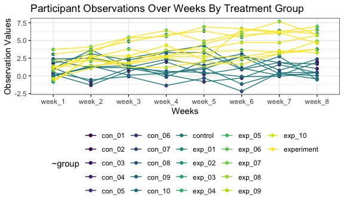

hw5
================

# Problem 1

``` r
# Code Jeff gave us
set.seed(10)

iris_with_missing = iris %>% 
  map_df(~replace(.x, sample(1:150, 20), NA)) %>%
  mutate(Species = as.character(Species))

is.list(iris_with_missing)
```

    ## [1] TRUE

``` r
missing_value = function(x) {
  if (is.numeric(x)) {                    # if the value is numeric 
    y = mean(x, na.rm = TRUE)             # take the mean of the column x and save it as a value y
    x = replace(x, is.na(x), y)           # then replace any missing values in column x with the value y
  } else if (is.character(x)) {           # if the value is character variable
    x = replace(x, is.na(x), "virginica") # replace missing values in column x with virginica
  }
}

# create an output where i map my function onto each variable in my dataframe
output = map_df(iris_with_missing, missing_value)   

# checking to see if my output really works
output 
```

    ## # A tibble: 150 x 5
    ##    Sepal.Length Sepal.Width Petal.Length Petal.Width Species
    ##           <dbl>       <dbl>        <dbl>       <dbl> <chr>  
    ##  1         5.1          3.5         1.4         0.2  setosa 
    ##  2         4.9          3           1.4         0.2  setosa 
    ##  3         4.7          3.2         1.3         0.2  setosa 
    ##  4         4.6          3.1         1.5         1.19 setosa 
    ##  5         5            3.6         1.4         0.2  setosa 
    ##  6         5.4          3.9         1.7         0.4  setosa 
    ##  7         5.82         3.4         1.4         0.3  setosa 
    ##  8         5            3.4         1.5         0.2  setosa 
    ##  9         4.4          2.9         1.4         0.2  setosa 
    ## 10         4.9          3.1         3.77        0.1  setosa 
    ## # … with 140 more rows

# Problem 2: data

``` r
# Creating a tibble of data with file names and data

prob_data = tibble(
  subject = list.files(path = "./hw5_data",      # creating a variable "files" for filenames
                     pattern = ".csv$", 
                     full.names = TRUE)) %>%
  mutate(data =  map(subject, read_csv)) %>%    # creating a variable "data" where i read the csv files
  unnest()                                    # unnesting the variable "data"
```

    ## Parsed with column specification:
    ## cols(
    ##   week_1 = col_double(),
    ##   week_2 = col_double(),
    ##   week_3 = col_double(),
    ##   week_4 = col_double(),
    ##   week_5 = col_double(),
    ##   week_6 = col_double(),
    ##   week_7 = col_double(),
    ##   week_8 = col_double()
    ## )
    ## Parsed with column specification:
    ## cols(
    ##   week_1 = col_double(),
    ##   week_2 = col_double(),
    ##   week_3 = col_double(),
    ##   week_4 = col_double(),
    ##   week_5 = col_double(),
    ##   week_6 = col_double(),
    ##   week_7 = col_double(),
    ##   week_8 = col_double()
    ## )
    ## Parsed with column specification:
    ## cols(
    ##   week_1 = col_double(),
    ##   week_2 = col_double(),
    ##   week_3 = col_double(),
    ##   week_4 = col_double(),
    ##   week_5 = col_double(),
    ##   week_6 = col_double(),
    ##   week_7 = col_double(),
    ##   week_8 = col_double()
    ## )
    ## Parsed with column specification:
    ## cols(
    ##   week_1 = col_double(),
    ##   week_2 = col_double(),
    ##   week_3 = col_double(),
    ##   week_4 = col_double(),
    ##   week_5 = col_double(),
    ##   week_6 = col_double(),
    ##   week_7 = col_double(),
    ##   week_8 = col_double()
    ## )
    ## Parsed with column specification:
    ## cols(
    ##   week_1 = col_double(),
    ##   week_2 = col_double(),
    ##   week_3 = col_double(),
    ##   week_4 = col_double(),
    ##   week_5 = col_double(),
    ##   week_6 = col_double(),
    ##   week_7 = col_double(),
    ##   week_8 = col_double()
    ## )
    ## Parsed with column specification:
    ## cols(
    ##   week_1 = col_double(),
    ##   week_2 = col_double(),
    ##   week_3 = col_double(),
    ##   week_4 = col_double(),
    ##   week_5 = col_double(),
    ##   week_6 = col_double(),
    ##   week_7 = col_double(),
    ##   week_8 = col_double()
    ## )
    ## Parsed with column specification:
    ## cols(
    ##   week_1 = col_double(),
    ##   week_2 = col_double(),
    ##   week_3 = col_double(),
    ##   week_4 = col_double(),
    ##   week_5 = col_double(),
    ##   week_6 = col_double(),
    ##   week_7 = col_double(),
    ##   week_8 = col_double()
    ## )
    ## Parsed with column specification:
    ## cols(
    ##   week_1 = col_double(),
    ##   week_2 = col_double(),
    ##   week_3 = col_double(),
    ##   week_4 = col_double(),
    ##   week_5 = col_double(),
    ##   week_6 = col_double(),
    ##   week_7 = col_double(),
    ##   week_8 = col_double()
    ## )
    ## Parsed with column specification:
    ## cols(
    ##   week_1 = col_double(),
    ##   week_2 = col_double(),
    ##   week_3 = col_double(),
    ##   week_4 = col_double(),
    ##   week_5 = col_double(),
    ##   week_6 = col_double(),
    ##   week_7 = col_double(),
    ##   week_8 = col_double()
    ## )
    ## Parsed with column specification:
    ## cols(
    ##   week_1 = col_double(),
    ##   week_2 = col_double(),
    ##   week_3 = col_double(),
    ##   week_4 = col_double(),
    ##   week_5 = col_double(),
    ##   week_6 = col_double(),
    ##   week_7 = col_double(),
    ##   week_8 = col_double()
    ## )
    ## Parsed with column specification:
    ## cols(
    ##   week_1 = col_double(),
    ##   week_2 = col_double(),
    ##   week_3 = col_double(),
    ##   week_4 = col_double(),
    ##   week_5 = col_double(),
    ##   week_6 = col_double(),
    ##   week_7 = col_double(),
    ##   week_8 = col_double()
    ## )
    ## Parsed with column specification:
    ## cols(
    ##   week_1 = col_double(),
    ##   week_2 = col_double(),
    ##   week_3 = col_double(),
    ##   week_4 = col_double(),
    ##   week_5 = col_double(),
    ##   week_6 = col_double(),
    ##   week_7 = col_double(),
    ##   week_8 = col_double()
    ## )
    ## Parsed with column specification:
    ## cols(
    ##   week_1 = col_double(),
    ##   week_2 = col_double(),
    ##   week_3 = col_double(),
    ##   week_4 = col_double(),
    ##   week_5 = col_double(),
    ##   week_6 = col_double(),
    ##   week_7 = col_double(),
    ##   week_8 = col_double()
    ## )
    ## Parsed with column specification:
    ## cols(
    ##   week_1 = col_double(),
    ##   week_2 = col_double(),
    ##   week_3 = col_double(),
    ##   week_4 = col_double(),
    ##   week_5 = col_double(),
    ##   week_6 = col_double(),
    ##   week_7 = col_double(),
    ##   week_8 = col_double()
    ## )
    ## Parsed with column specification:
    ## cols(
    ##   week_1 = col_double(),
    ##   week_2 = col_double(),
    ##   week_3 = col_double(),
    ##   week_4 = col_double(),
    ##   week_5 = col_double(),
    ##   week_6 = col_double(),
    ##   week_7 = col_double(),
    ##   week_8 = col_double()
    ## )
    ## Parsed with column specification:
    ## cols(
    ##   week_1 = col_double(),
    ##   week_2 = col_double(),
    ##   week_3 = col_double(),
    ##   week_4 = col_double(),
    ##   week_5 = col_double(),
    ##   week_6 = col_double(),
    ##   week_7 = col_double(),
    ##   week_8 = col_double()
    ## )
    ## Parsed with column specification:
    ## cols(
    ##   week_1 = col_double(),
    ##   week_2 = col_double(),
    ##   week_3 = col_double(),
    ##   week_4 = col_double(),
    ##   week_5 = col_double(),
    ##   week_6 = col_double(),
    ##   week_7 = col_double(),
    ##   week_8 = col_double()
    ## )
    ## Parsed with column specification:
    ## cols(
    ##   week_1 = col_double(),
    ##   week_2 = col_double(),
    ##   week_3 = col_double(),
    ##   week_4 = col_double(),
    ##   week_5 = col_double(),
    ##   week_6 = col_double(),
    ##   week_7 = col_double(),
    ##   week_8 = col_double()
    ## )
    ## Parsed with column specification:
    ## cols(
    ##   week_1 = col_double(),
    ##   week_2 = col_double(),
    ##   week_3 = col_double(),
    ##   week_4 = col_double(),
    ##   week_5 = col_double(),
    ##   week_6 = col_double(),
    ##   week_7 = col_double(),
    ##   week_8 = col_double()
    ## )
    ## Parsed with column specification:
    ## cols(
    ##   week_1 = col_double(),
    ##   week_2 = col_double(),
    ##   week_3 = col_double(),
    ##   week_4 = col_double(),
    ##   week_5 = col_double(),
    ##   week_6 = col_double(),
    ##   week_7 = col_double(),
    ##   week_8 = col_double()
    ## )

    ## Warning: `cols` is now required.
    ## Please use `cols = c(data)`

``` r
#tidy the resulting dataset

prob_data =
pivot_longer(prob_data, 
             week_1:week_8,                            # pivoting longer to make each column a variable
             names_to = "week",
              values_to = "observations") %>%
  mutate(subject = str_remove(subject, "./hw5_data/"),    # removing beginning/end of the subject column
         subject = str_remove(subject, ".csv"),
         subject = str_replace(subject, "con_", "control "), # changing prefixes to full study arm
         subject = str_replace(subject, "exp_", "experimental ")) %>% 
  select(subject, week, observations)                   # selecting in the order I want  

knitr::kable(prob_data)  # making a nice table
```

| subject         | week    | observations |
| :-------------- | :------ | -----------: |
| control 01      | week\_1 |         0.20 |
| control 01      | week\_2 |       \-1.31 |
| control 01      | week\_3 |         0.66 |
| control 01      | week\_4 |         1.96 |
| control 01      | week\_5 |         0.23 |
| control 01      | week\_6 |         1.09 |
| control 01      | week\_7 |         0.05 |
| control 01      | week\_8 |         1.94 |
| control 02      | week\_1 |         1.13 |
| control 02      | week\_2 |       \-0.88 |
| control 02      | week\_3 |         1.07 |
| control 02      | week\_4 |         0.17 |
| control 02      | week\_5 |       \-0.83 |
| control 02      | week\_6 |       \-0.31 |
| control 02      | week\_7 |         1.58 |
| control 02      | week\_8 |         0.44 |
| control 03      | week\_1 |         1.77 |
| control 03      | week\_2 |         3.11 |
| control 03      | week\_3 |         2.22 |
| control 03      | week\_4 |         3.26 |
| control 03      | week\_5 |         3.31 |
| control 03      | week\_6 |         0.89 |
| control 03      | week\_7 |         1.88 |
| control 03      | week\_8 |         1.01 |
| control 04      | week\_1 |         1.04 |
| control 04      | week\_2 |         3.66 |
| control 04      | week\_3 |         1.22 |
| control 04      | week\_4 |         2.33 |
| control 04      | week\_5 |         1.47 |
| control 04      | week\_6 |         2.70 |
| control 04      | week\_7 |         1.87 |
| control 04      | week\_8 |         1.66 |
| control 05      | week\_1 |         0.47 |
| control 05      | week\_2 |       \-0.58 |
| control 05      | week\_3 |       \-0.09 |
| control 05      | week\_4 |       \-1.37 |
| control 05      | week\_5 |       \-0.32 |
| control 05      | week\_6 |       \-2.17 |
| control 05      | week\_7 |         0.45 |
| control 05      | week\_8 |         0.48 |
| control 06      | week\_1 |         2.37 |
| control 06      | week\_2 |         2.50 |
| control 06      | week\_3 |         1.59 |
| control 06      | week\_4 |       \-0.16 |
| control 06      | week\_5 |         2.08 |
| control 06      | week\_6 |         3.07 |
| control 06      | week\_7 |         0.78 |
| control 06      | week\_8 |         2.35 |
| control 07      | week\_1 |         0.03 |
| control 07      | week\_2 |         1.21 |
| control 07      | week\_3 |         1.13 |
| control 07      | week\_4 |         0.64 |
| control 07      | week\_5 |         0.49 |
| control 07      | week\_6 |       \-0.12 |
| control 07      | week\_7 |       \-0.07 |
| control 07      | week\_8 |         0.46 |
| control 08      | week\_1 |       \-0.08 |
| control 08      | week\_2 |         1.42 |
| control 08      | week\_3 |         0.09 |
| control 08      | week\_4 |         0.36 |
| control 08      | week\_5 |         1.18 |
| control 08      | week\_6 |       \-1.16 |
| control 08      | week\_7 |         0.33 |
| control 08      | week\_8 |       \-0.44 |
| control 09      | week\_1 |         0.08 |
| control 09      | week\_2 |         1.24 |
| control 09      | week\_3 |         1.44 |
| control 09      | week\_4 |         0.41 |
| control 09      | week\_5 |         0.95 |
| control 09      | week\_6 |         2.75 |
| control 09      | week\_7 |         0.30 |
| control 09      | week\_8 |         0.03 |
| control 10      | week\_1 |         2.14 |
| control 10      | week\_2 |         1.15 |
| control 10      | week\_3 |         2.52 |
| control 10      | week\_4 |         3.44 |
| control 10      | week\_5 |         4.26 |
| control 10      | week\_6 |         0.97 |
| control 10      | week\_7 |         2.73 |
| control 10      | week\_8 |       \-0.53 |
| experimental 01 | week\_1 |         3.05 |
| experimental 01 | week\_2 |         3.67 |
| experimental 01 | week\_3 |         4.84 |
| experimental 01 | week\_4 |         5.80 |
| experimental 01 | week\_5 |         6.33 |
| experimental 01 | week\_6 |         5.46 |
| experimental 01 | week\_7 |         6.38 |
| experimental 01 | week\_8 |         5.91 |
| experimental 02 | week\_1 |       \-0.84 |
| experimental 02 | week\_2 |         2.63 |
| experimental 02 | week\_3 |         1.64 |
| experimental 02 | week\_4 |         2.58 |
| experimental 02 | week\_5 |         1.24 |
| experimental 02 | week\_6 |         2.32 |
| experimental 02 | week\_7 |         3.11 |
| experimental 02 | week\_8 |         3.78 |
| experimental 03 | week\_1 |         2.15 |
| experimental 03 | week\_2 |         2.08 |
| experimental 03 | week\_3 |         1.82 |
| experimental 03 | week\_4 |         2.84 |
| experimental 03 | week\_5 |         3.36 |
| experimental 03 | week\_6 |         3.61 |
| experimental 03 | week\_7 |         3.37 |
| experimental 03 | week\_8 |         3.74 |
| experimental 04 | week\_1 |       \-0.62 |
| experimental 04 | week\_2 |         2.54 |
| experimental 04 | week\_3 |         3.78 |
| experimental 04 | week\_4 |         2.73 |
| experimental 04 | week\_5 |         4.49 |
| experimental 04 | week\_6 |         5.82 |
| experimental 04 | week\_7 |         6.00 |
| experimental 04 | week\_8 |         6.49 |
| experimental 05 | week\_1 |         0.70 |
| experimental 05 | week\_2 |         3.33 |
| experimental 05 | week\_3 |         5.34 |
| experimental 05 | week\_4 |         5.57 |
| experimental 05 | week\_5 |         6.90 |
| experimental 05 | week\_6 |         6.66 |
| experimental 05 | week\_7 |         6.24 |
| experimental 05 | week\_8 |         6.95 |
| experimental 06 | week\_1 |         3.73 |
| experimental 06 | week\_2 |         4.08 |
| experimental 06 | week\_3 |         5.40 |
| experimental 06 | week\_4 |         6.41 |
| experimental 06 | week\_5 |         4.87 |
| experimental 06 | week\_6 |         6.09 |
| experimental 06 | week\_7 |         7.66 |
| experimental 06 | week\_8 |         5.83 |
| experimental 07 | week\_1 |         1.18 |
| experimental 07 | week\_2 |         2.35 |
| experimental 07 | week\_3 |         1.23 |
| experimental 07 | week\_4 |         1.17 |
| experimental 07 | week\_5 |         2.02 |
| experimental 07 | week\_6 |         1.61 |
| experimental 07 | week\_7 |         3.13 |
| experimental 07 | week\_8 |         4.88 |
| experimental 08 | week\_1 |         1.37 |
| experimental 08 | week\_2 |         1.43 |
| experimental 08 | week\_3 |         1.84 |
| experimental 08 | week\_4 |         3.60 |
| experimental 08 | week\_5 |         3.80 |
| experimental 08 | week\_6 |         4.72 |
| experimental 08 | week\_7 |         4.68 |
| experimental 08 | week\_8 |         5.70 |
| experimental 09 | week\_1 |       \-0.40 |
| experimental 09 | week\_2 |         1.08 |
| experimental 09 | week\_3 |         2.66 |
| experimental 09 | week\_4 |         2.70 |
| experimental 09 | week\_5 |         2.80 |
| experimental 09 | week\_6 |         2.64 |
| experimental 09 | week\_7 |         3.51 |
| experimental 09 | week\_8 |         3.27 |
| experimental 10 | week\_1 |         1.09 |
| experimental 10 | week\_2 |         2.80 |
| experimental 10 | week\_3 |         2.80 |
| experimental 10 | week\_4 |         4.30 |
| experimental 10 | week\_5 |         2.25 |
| experimental 10 | week\_6 |         6.57 |
| experimental 10 | week\_7 |         6.09 |
| experimental 10 | week\_8 |         4.64 |

NEED TO GROUP BY ARM

# Problem 2: plot

``` r
# creating a spaghetti plot for the dataframe created above

plot_ppt_data = 
  ggplot(prob_data, aes(x = week, y = observations, color = subject, group = subject)) +
  geom_point() +
  geom_line(aes(color = subject)) +
  viridis::scale_color_viridis(aes(color = subject), discrete = TRUE) +
  labs(
    title = "Participant Observations Over Weeks By Treatment Group",
    x = "Weeks",
    y = "Observation Values"
  )

plot_ppt_data
```



The resulting plot shows the observation values for each participant
over the course of 8 weeks. The control group appear to have lower
observation values across weeks of the study compared to the
experimental arm. The participants generally start from a similar
baseline (the groups are overlapped), but as the trial moves forward,
the measurements get much higher for the experimental group and stay
about the same for the control group.

ADD AVERAGES MAX/MIN ONCE GET IT GROUPED BY ARM

# Problem 3
